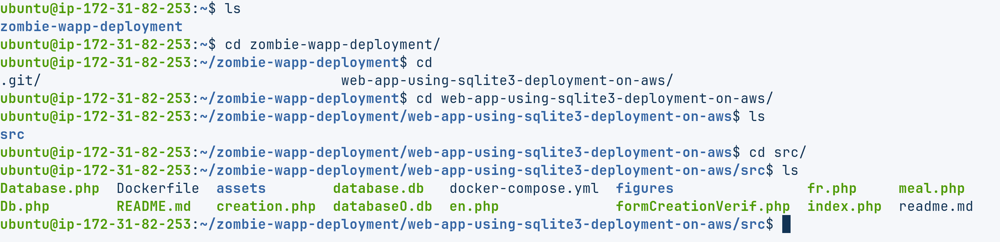
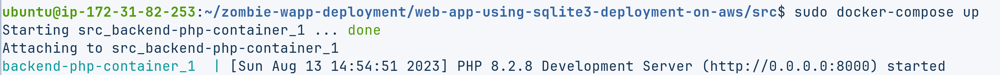

##  Deploying web app and sqlite DB on aws EC2 cloud using docker (simple way)


## Table of Contents
1. [Set up Dockerfile](#set-up-dockerfile)
2. [launch AWS ubuntu server instance](#launch-aws-ubuntu-server-instance)
3. [](#technologies)


## Set up Dockerfile

In order to deploy our web app onto cloud using docker, we need to edit specificaly file named ***Dockerfile** that look like this:


```bash
FROM php:latest

# Define container working directory.
WORKDIR /app

# Copy project located in current dir (.) into container working directory that can accessed by (.)
COPY . .

# Expose port 8000
EXPOSE 8000

# Start the PHP development server
CMD ["php", "-S", "0.0.0.0:8000"]

# Next we need to lauch this cmd: docker build -t zappimg .
```


After setting up Dockerfile, we'll build image from above script.


```bash
# docker build -t <image name>
$ docker build -t za-php-backend-img .

# docker run -it --rm --name <container name> <image name> 
$ docker run -it --rm -p 8000:8000 --name za-php-backend-ctnr za-php-backend-img
```

***Note:*** Instruction ```-p xxxx:yyyy``` means we wanted to map host port 8000 to container port 8000. 

## Launch AWS ubuntu server instance

Our aim is to host the scripts for our web application. For this, We'll be using aws cloud computing, in particular the EC2 service, which is a virtual appliance. 

You can choose one of ubuntu-server aws instance. 


To connect to your EC2 instance prompt, you can use peace of code below:

```bash 
SSH_KEY=path/to/your/ec2-permission-key/ec2-key.pem # the file path you downloaded the key
INSTANCE_IP=aaa.bbb.ccc.ddd # find your IP address in the EC2 console under the Instances tab
chmod 400 $SSH_KEY # or ssh will complain that the key has the wrong permissions
ssh -i $SSH_KEY ec2-user@$INSTANCE_IP # connect to the aws ec2 instance AMI and the your private IP address

```

Once you're connected to instance prompt, we'll clone our project from github

```bash
git clone https://github.com/godamg/zombie-wapp-deployment.git
```

Then launch docker compose command in order to build and run container.





